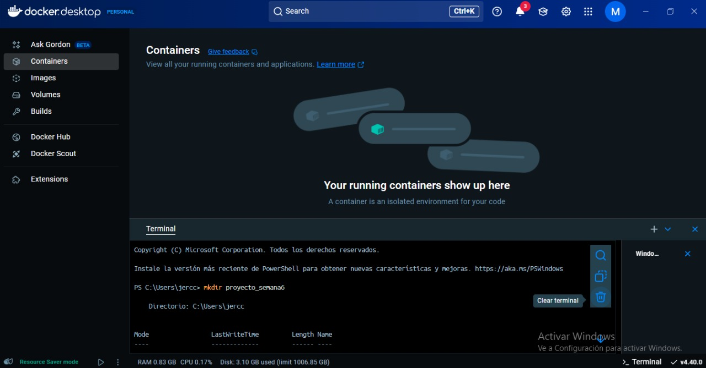
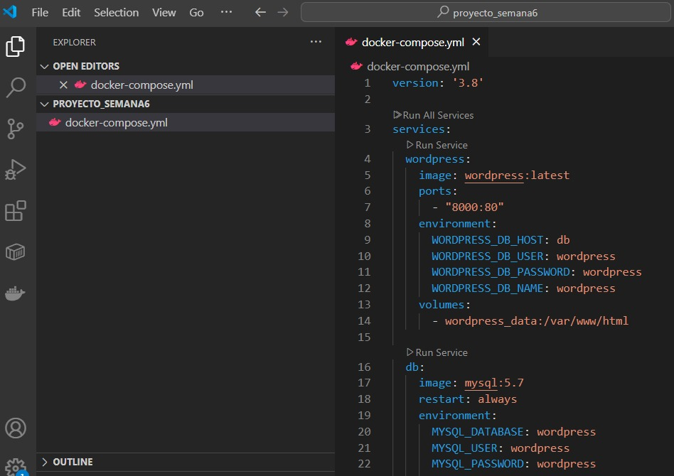
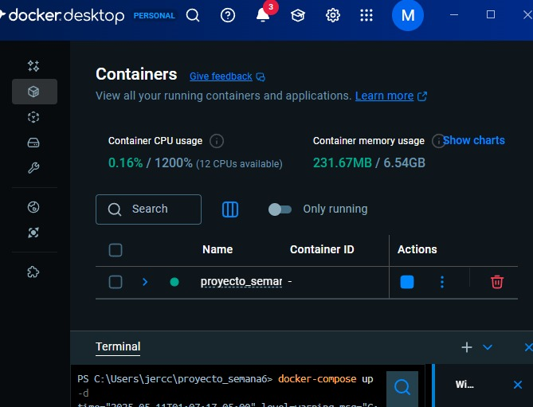
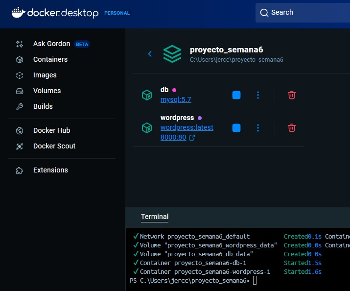
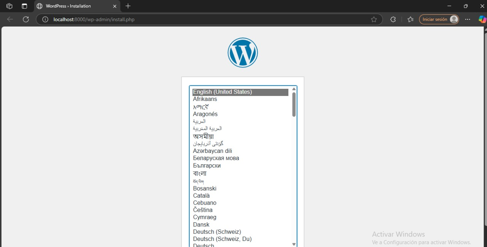
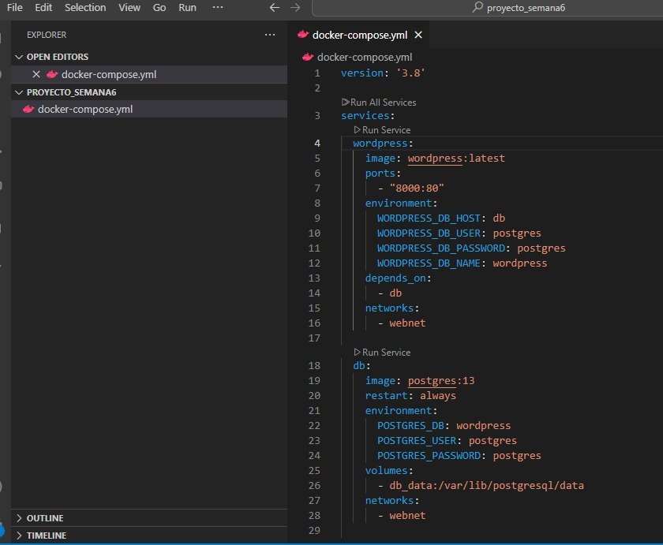

# TENDENCIAS TECNOLOGICAS

## 1. Titulo
TAS6 - Wordpress con docker compose YML
## 2. Tiempo de duración
El tiempo de duración fue de 3 horas aproximadamente para el desarrollo de la práctica.

## 3. Fundamentos:

En esta práctica se trabajó con ....

..... permite 

La práctica se enfoca en tres aspectos fundamentales:

**Uso de Docker Compose**: Permite gestionar contenedores en un entorno de desarrollo más eficiente.
- **Interacción entre servicios**: Se estableció la conexión entre WordPress, PostgreSQL y phpMyAdmin.
- **Persistencia de datos**: A través de volúmenes para asegurar la continuidad de la información.

Esta metodología permite a los estudiantes comprender cómo configurar y administrar aplicaciones usando contenedores Docker, facilitando la implementación y escalabilidad de proyectos web.

## 4. Conocimientos previos.

Para realizar esta practica el estudiante necesita tener claro los siguientes temas:
- Línea de comandos (CLI)
- Navegadores web
- Uso de MySQL y PostgreSQL
- Uso de phpMyAdmin
- Formato YML
- Docker-compose
- Servicios, redes y volumenes

## 5. Objetivos a alcanzar

- Implementar contenedores usando docker compose para permitir la comunicación entre diversos servicios y mantener una estructura robusta.

## 6. Equipo necesario:

- Navegador web para acceder a phpMyAdmin y WordPress
- Computadora con sistema operativo Windows/Linux/Mac
- Acceso a Docker Play o instalación local de Docker

## 7. Material de apoyo.

- Documentación oficial de Docker
- Documentación oficial de MySQL
- Documentación oficial de phpMyAdmin
- Documentación oficial de WordPress
- Guía proporcionada en la asignatura

## 8. Procedimiento

## Parte 1: Wordpress con postgresql-pgadmin  en docker-compose.

### Paso 1:Construir un archivo docker compose usando el formato YML.

Primero crear un carpeta dentro de la terminal.

Crear el archivo docker-compose.yml, en mi caso ocupo de visual code.

Creo los contenedores que se necesita se descargará las imágenes y levantará WordPress + MySQL.

Verifico en el navegador abriendo su localhost:8000

### Paso 2:Estructurar 3 servicios: wordpress, mysql, phpmyadmin

En este paso se define el contenido del archivo docker-compose.yml con tres servicios:
wordpress
db (PostgreSQL)
phpmyadmin
Cada uno de estos servicios está configurado con su respectiva imagen, variables de entorno, puertos y volúmenes para la persistencia de datos.

### Paso 3: Definir una red.

La red webnet se define en el archivo para que los servicios puedan comunicarse entre sí a través de la red interna de Docker. Esto asegura que los contenedores estén aislados de otras redes.

### Paso 4: Definir un volumen

Los volúmenes permiten la persistencia de datos fuera del contenedor. Esto es útil para evitar que los datos se pierdan cuando se detienen o eliminan los contenedores. En este caso, los volúmenes wordpress_data y db_data se utilizan para WordPress y PostgreSQL, respectivamente.

## 9. Resultados esperados:

- Al ejecutar docker-compose up -d, los tres servicios deberían iniciar correctamente.
- WordPress debería estar accesible en el puerto 8000.
- phpMyAdmin debería estar disponible en el puerto 8080, permitiendo gestionar la base de datos PostgreSQL.
- Los volúmenes garantizarán que los datos no se pierdan entre reinicios de los contenedores.

## 10. Bibliografía

- Docker Inc. (2024). Docker documentation. https://docs.docker.com

- Miell, I., & Sayers, A. (2019). Docker in practice (2nd ed.). Manning Publications.

- Nickoloff, J., & Kuenzli, S. (2019). Docker in action (2nd ed.). Manning Publications.

- phpMyAdmin. (2024). phpMyAdmin documentation. https://docs.phpmyadmin.net/

- PostgreSQL Documentation Team. (2024). PostgreSQL 13 reference manual. https://www.postgresql.org/docs/

- WordPress.org. (2024). WordPress documentation. https://wordpress.org/support/

