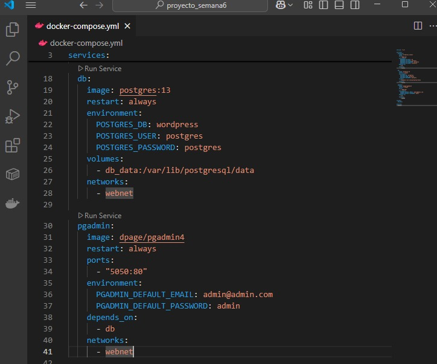
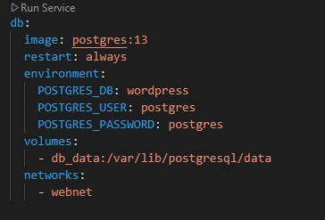
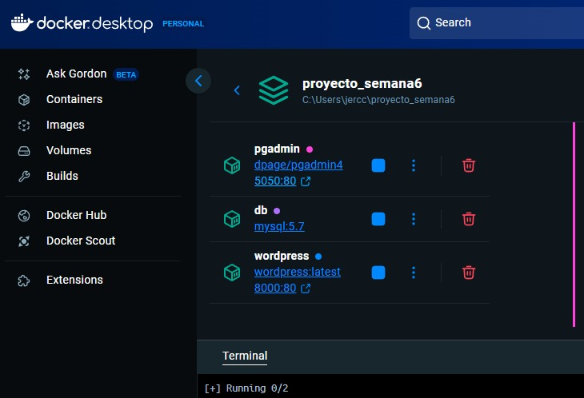
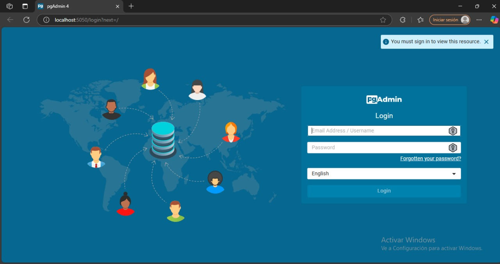
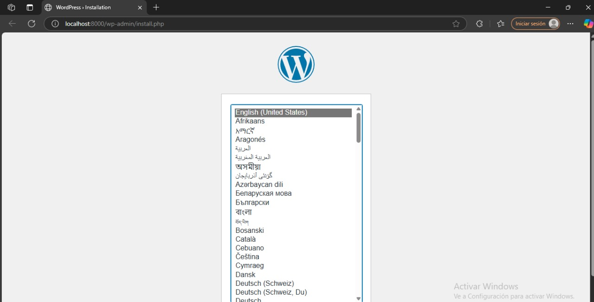

# TENDENCIAS TECNOLOGICAS

## 1. Titulo
TAS6 - Wordpress con docker compose YML
## 2. Tiempo de duración
El tiempo de duración fue de 3 horas aproximadamente para el desarrollo de la práctica.

## 3. Fundamentos:

En esta práctica se utiliza Docker Compose, una herramienta que facilita la gestión de aplicaciones multi-contenedor en entornos de desarrollo. Docker Compose emplea un archivo de configuración en formato YML (YAML), donde se especifican las definiciones de los servicios, redes y volúmenes necesarios para orquestar los contenedores de una aplicación.

Docker Compose permite gestionar aplicaciones complejas a través de contenedores. En lugar de iniciar manualmente cada servicio (como WordPress, bases de datos o herramientas de administración), Docker Compose permite definir y orquestar todos los contenedores necesarios mediante un único archivo YAML. Esto resulta especialmente útil cuando se desarrollan aplicaciones que requieren múltiples componentes que deben interactuar entre sí, como una aplicación web que se conecta a una base de datos y necesita un sistema de administración.

Interacción entre servicios:
En este proyecto, se configuró la interacción entre varios servicios usando Docker Compose:

WordPress: Un sistema de gestión de contenido (CMS) popular, que requiere una base de datos para almacenar su contenido, como entradas de blog o configuraciones de usuario

PostgreSQL/MySQL: Base de datos relacional utilizada para almacenar toda la información dinámica del sitio web.  PostgreSQL se utiliza comúnmente por su robustez, mientras que MySQL es una opción igualmente popular, especialmente en entornos más pequeños o con requisitos específicos.

phpMyAdmin/pgAdmin: Herramientas gráficas para la administración de bases de datos. phpMyAdmin se utiliza para MySQL, mientras que pgAdmin es el equivalente para PostgreSQL,  esta permite la administración visual y la ejecución de consultas SQL.

A través de Docker Compose, se logra que estos servicios se comuniquen entre sí sin necesidad de configurar redes y puertos manualmente, porque esta herramienta permite el  maneja de todo automáticamente evitando errores por la configuración manual.

La práctica se enfoca en tres aspectos fundamentales:

- Uso de Docker Compose: Permite gestionar contenedores en un entorno de desarrollo más eficiente.
- Interacción entre servicios: Se estableció la conexión entre WordPress, MySQL y phpMyAdmin.
- Persistencia de datos: A través de volúmenes para asegurar la continuidad de la información.

Esta metodología permite a los estudiantes comprender cómo configurar y administrar entornose de desarrollo usando contenedores Docker, facilitando la implementación y escalabilidad de aplicaciones.

## 4. Conocimientos previos.

Para realizar esta practica el estudiante necesita tener claro los siguientes temas:
- Línea de comandos (CLI)
- Navegadores web
- Uso de MySQL, PostgreSQL y wordpress
- Uso de phpMyAdmin
- FComprensión del formato YML
- Uso de Docker-compose
- Conceptos de Servicios, redes y volumenes

## 5. Objetivos a alcanzar

- Implementar contenedores usando docker compose para permitir la comunicación entre diversos servicios y mantener una estructura robusta.
- Configurar entornos de desarrollo replicables y portables para aplicaciones como WordPress.
- Comprender el uso de redes y volúmenes en la gestión de contenedores.

## 6. Equipo necesario:

- Navegador web para acceder a phpMyAdmin y WordPress
- Computadora con sistema operativo Windows/Linux/Mac
- Acceso a Docker Play o instalación local de Docker
- Editor de texto o IDE (como Visual Studio Code)

## 7. Material de apoyo.

- Documentación oficial de Docker
- Documentación oficial de MySQL
- Documentación oficial de phpMyAdmin
- Documentación oficial de WordPress
- Guía proporcionada en la asignatura

## 8. Procedimiento

## Parte 1: Wordpress con postgresql-pgadmin  en docker-compose.

### Paso 1:Construir un archivo docker compose usando el formato YML.

Primero crear un carpeta dentro de la terminal.

Crear el archivo docker-compose.yml, en mi caso ocupo de visual code.

Creo los contenedores que se necesita se descargará las imágenes y levantará WordPress + MySQL.

Verifico en el navegador abriendo su localhost:8000

### Paso 2:Estructurar 3 servicios: wordpress, mysql, phpmyadmin

En este paso se define el contenido del archivo docker-compose.yml con tres servicios:
wordpress
MySQL
phpmyadmin
Cada uno de estos servicios está configurado con su respectiva imagen, variables de entorno, puertos y volúmenes para la persistencia de datos.

### Paso 3: Definir una red.

Dentro del docker-compose.yml, se crea una red llamada webnet
Esta red webnet permite que el archivo para que los servicios puedan comunicarse entre sí a través de la red interna es decir de la misma red. Esto asegura que los contenedores estén aislados de otras redes.
 
 como en la siguiente imagen que se aprecia de postgres 
  networks:
      - webnet

### Paso 4: Definir un volumen

Los volúmenes permiten que los datos persistan aunque se detenga, elimine el contenedor o datos fuera del contenedor.
Esto ayuda a evitar que los datos se pierdan cuando se detienen o eliminan los contenedores. Los volúmenes wordpress_data y db_data se utilizan para WordPress y PostgreSQL, respectivamente.

Como resultado tenemos los 3 servicios:

Resultado de pgADMIN

Resultado de worpress

## 9. Resultados esperados:

- Al ejecutar docker-compose up -d, los tres servicios deberían iniciar correctamente sin errores.
- El servicio WordPress debe estar accesible en el puerto 8000 del host local, eso quiere decir que debe abrir en el navegador y acceder a localhost:8000. Esta debe abrir la pantalla de instalación de  WordPress así demuestra que tiene concección con la base de datos.
- phpMyAdmin debería estar disponible en el puerto 5050, permitiendo gestionar la base de datos MySQL.
- Los volúmenes garantizarán que los datos no se pierdan entre reinicios de los contenedores.

## 10. Bibliografía

- Docker Inc. (2024). Docker documentation. https://docs.docker.com

- Miell, I., & Sayers, A. (2019). Docker in practice (2nd ed.). Manning Publications.

- Nickoloff, J., & Kuenzli, S. (2019). Docker in action (2nd ed.). Manning Publications.

- phpMyAdmin. (2024). phpMyAdmin documentation. https://docs.phpmyadmin.net/

- PostgreSQL Documentation Team. (2024). PostgreSQL 13 reference manual. https://www.postgresql.org/docs/

- WordPress.org. (2024). WordPress documentation. https://wordpress.org/support/

